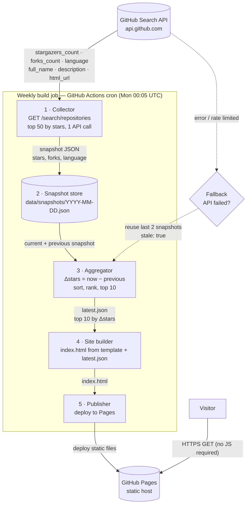

# Architecture Design — Top 10 Trending GitHub Repos Tracker

**Date**: 2026-09-14
**Spec**: [PRD.md](./PRD.md) (source of truth)
**Approach**: Spec-Driven Development — every component below traces to a PRD acceptance criterion (AC); no speculative generality (YAGNI)

---

## ADR-001: BFF pattern vs Static Site Generator

### Context

The PRD specifies a single-page site, refreshed weekly, showing 10 rows of data from one external API (GitHub Search). Requirements: scheduled automation (AC-1), graceful degradation on API failure (AC-7), zero manual steps, data ≤ 8 days old.

### Options considered

**Option A — Backend for Frontend (BFF):** a runtime service that aggregates GitHub data per request and shapes it for the page.

| BFF is for | This project |
|---|---|
| Aggregating **multiple** downstream services per request | 1 downstream API |
| **Multiple client types** (web/mobile/API) needing different payloads | 1 static page |
| **Per-request** personalization or freshness | Weekly batch freshness |
| Hiding a complex internal topology | Public API, directly callable |

**Option B — Static Site Generator with build-time data pipeline:** a scheduled CI job fetches, aggregates, ranks, and renders the site once per week; the host serves static files.

| Criterion | BFF (A) | SSG (B) |
|---|---|---|
| Aggregation timing | Per request (wasted 10,000×) | Once per week (matches data change rate) |
| Runtime infrastructure | Always-on server or serverless fn + monitoring | None (static host) |
| Cost | > $0 | $0 (GitHub Pages) |
| Failure mode on API outage | Runtime errors, needs fallback logic + observability | Previous deployment stays live automatically |
| Security surface | Public runtime endpoint to patch/harden | None |
| Latency | Server round-trip | Static CDN |
| Operational burden | Deploy, scale, alert | 1 cron workflow |

### Decision

**Option B — Static site generator with a build-time data pipeline.** Rejected: BFF.

Rationale: the *only* "backend" work — fetching and aggregating — happens once per week, not per request. A BFF would move weekly work into the request path for zero benefit. The weekly CI job **is** the backend; it is a batch backend, which is the correct shape for batch-shaped data.

### Trade-offs accepted

- Data is at most ~7 days + one failed-run old (≤ 8 days per success metric); no intra-week updates.
- Ranking pool limited to top 50 repos by stars (1 API call). Expanding the pool later costs more calls, not more architecture.
- No per-visitor personalization (out of scope per PRD §6).

### Escalation triggers (when to revisit)

Revisit BFF (or a serverless aggregator) only if: (a) refresh cadence drops to daily/hourly, (b) a second downstream data source appears, or (c) a consumer API/RSS is added — all explicitly out of scope today.

---

## ADR-002: Storage and stack

- **Snapshot store = the git repo itself** (`data/snapshots/YYYY-MM-DD.json`). ~50 rows/week — a database (even SQLite) is unjustified. Bonus: git history is free audit + rollback.
- **Pipeline language**: Python 3 stdlib (`urllib.request` + `json`) — one file, zero third-party deps.
- **Site**: plain `index.html` rendered at build time from a template; no framework, no client-side JS. AC-9 (links), AC-6 (null language), AC-8 (timestamp) all become build-time template work, so the page works even with JS disabled. Astro is the upgrade path if the site ever gains pages.
- **Host**: GitHub Pages (free, CDN, deploy via Actions artifact).

---

## Components (each traced to the spec)

| # | Component | Responsibility | Traces to |
|---|---|---|---|
| 1 | **Scheduler** | GitHub Actions workflow, `cron: 5 0 * * 1` (Mon 00:05 UTC) | AC-1 |
| 2 | **Collector** | 1 call: `GET /search/repositories?q=stars:>1000&sort=stars&order=desc&per_page=50`; extract `full_name`, `description`, `html_url`, `stargazers_count`, `forks_count`, `language` verbatim; write snapshot JSON | AC-5 |
| 3 | **Snapshot store** | `data/snapshots/*.json` in repo | AC-4, AC-5 |
| 4 | **Aggregator** | Load current + previous snapshot; `Δstars = stars_now − stars_prev`; sort Δ desc → stars desc → name asc; take top 10; emit `data/latest.json` | AC-3, AC-4 |
| 5 | **Site builder** | Render `index.html` from template + `latest.json`; handle null language, "as of" UTC timestamp, `target="_blank"` links | AC-2, AC-6, AC-8, AC-9, AC-10 |
| 6 | **Publisher** | Deploy `index.html` to GitHub Pages | AC-1 |
| 7 | **Fallback path** | On API failure: reuse last two snapshots, emit `stale: true`, still build + publish with stale indicator | AC-7 |

---

## Data contracts (the spec's interfaces)

**Snapshot** — `data/snapshots/2026-09-15.json` (immutable, one per run):

```json
{
  "snapshot_date": "2026-09-15",
  "fetched_at": "2026-09-15T00:05:12Z",
  "repos": [
    {
      "full_name": "owner/repo",
      "description": "…",
      "html_url": "https://github.com/owner/repo",
      "stars": 12345,
      "forks": 678,
      "language": "TypeScript"
    }
  ]
}
```

**Published payload** — `data/latest.json` (derived, regenerated each run):

```json
{
  "published_at": "2026-09-15T00:06:00Z",
  "as_of": "2026-09-15T00:05:12Z",
  "stale": false,
  "top10": [
    {
      "rank": 1,
      "full_name": "owner/repo",
      "description": "…",
      "html_url": "https://github.com/owner/repo",
      "stars": 12345,
      "forks": 678,
      "language": "TypeScript",
      "stars_last_week": 11200,
      "delta_stars": 1145
    }
  ]
}
```

Rules: `language` is `string | null`; `delta_stars ≥ 0` (sanity check — a negative delta is data corruption, fail the run loudly rather than publish).

---

## Mermaid — exact data flow



---

## AC traceability summary

| AC | Satisfied by |
|---|---|
| AC-1 scheduled, no manual trigger | Component 1 + 6 |
| AC-2 all 7 fields per row | Component 5 template + `latest.json` |
| AC-3 Δstars ranking + tie-breaks | Component 4 sort order |
| AC-4 exactly 10 after 2 snapshots | Component 4 + store |
| AC-5 API fields persisted unmodified | Component 2 |
| AC-6 null language renders | Component 5 template |
| AC-7 stale fallback | Component 7 |
| AC-8 "as of" UTC timestamp | `latest.json.as_of` + template |
| AC-9 correct links, new tab | `html_url` + template `target="_blank"` |
| AC-10 responsive ~400px | Component 5 CSS (no JS, no layout framework) |

---

## Risks

| Risk | Mitigation |
|---|---|
| GitHub Search API rate limit (60 req/hr unauth) | 1 call/week; add a PAT token if ever needed |
| Snapshot commits accumulate in repo history | ~1 file/week — negligible |
| Deleted repo between snapshots | Aggregator skips missing repo; if < 10, publish what exists and flag (PRD §8) |

## Decision log

- **ADR-001**: SSG + build-time pipeline; BFF rejected (this document).
- **ADR-002**: git repo as snapshot store; Python stdlib pipeline; plain HTML; GitHub Pages (this document).
